# System Architecture: Fire Controller

## 1. System Overview

The fire controller is a two-board system for real-time remote control of eight 12V outputs (solenoids, relays) from eight digital inputs. An input board reads sensor/switch states and continuously transmits them over an RS-485 serial link (up to 200ft) to an output board that drives high-current MOSFET outputs. The system targets **<10ms end-to-end latency** from input change to output response.

Both boards use the **STM32G070CBT6** (ARM Cortex-M0+, 64MHz, 128KB flash, 36KB SRAM, LQFP48) running Rust `no_std` firmware on the Embassy async framework. Each board lives in its own enclosure powered by 120V AC mains, with waterproof connectors for all external wiring.

### High-Level System Block Diagram

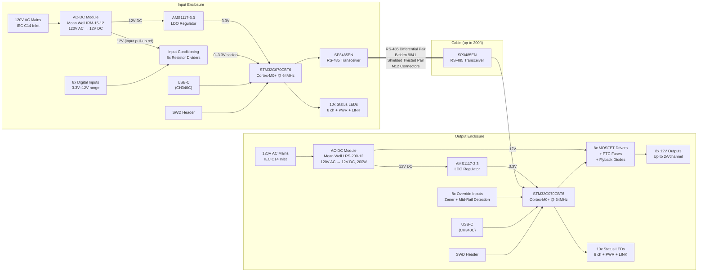

### Key Design Goals

| Goal | Target | Approach |
|------|--------|----------|
| End-to-end latency | <10ms (typical <2ms) | 1kHz polling, 115200 baud RS-485, minimal protocol overhead |
| Per-channel output current | Up to 2A @ 12V | Logic-level N-channel MOSFETs with heatsinking |
| Cable distance | Up to 200ft (61m) | RS-485 differential signaling, 120Ω termination |
| Input voltage range | 3.3V–12V per channel | Resistor divider to ADC range, software threshold |
| Environmental protection | IP67 external connectors | Amphenol AT series panel-mount, IEC C14 inlet |
| Board cost | <$50 target per board | STM32G070 (~$1.22), commodity passives, off-shelf PSU |
| Debuggability | Full access during development | SWD header, USB-UART bridge, test points, LED indicators |

---

## 2. Input Board Architecture

The input board is the "sender" (bus master) in the system. It continuously samples eight digital input channels and transmits their state over RS-485 at 1kHz. It also receives periodic heartbeat frames from the output board to confirm end-to-end link health.

### Block Diagram

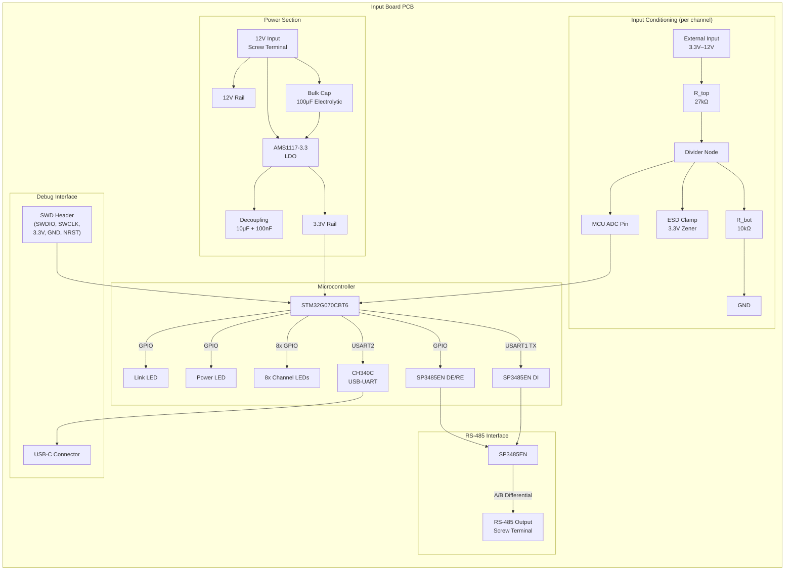

### Data Flow

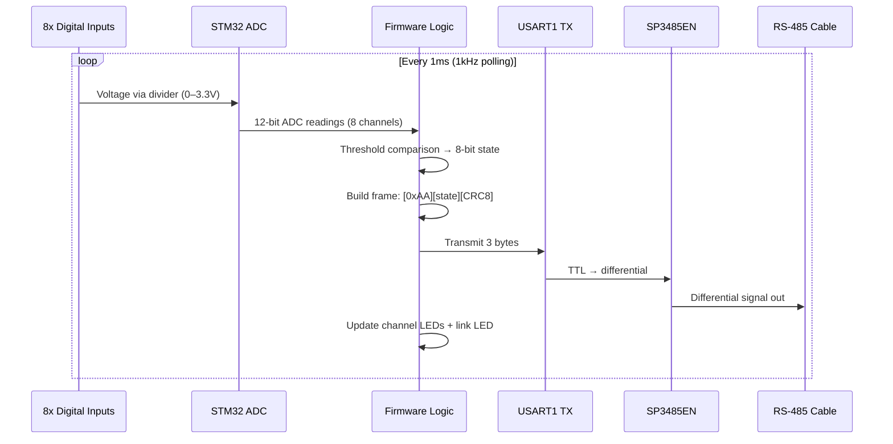

### Input Conditioning Detail

Each of the 8 input channels uses a resistor divider to scale the 3.3V–12V input range into the MCU's 0–3.3V ADC range.

**Divider calculation** (R_top = 27kΩ, R_bot = 10kΩ):

- At 12V input: V_adc = 12V × 10k / (27k + 10k) = **3.24V** (within 3.3V ADC range)
- At 3.3V input: V_adc = 3.3V × 10k / (27k + 10k) = **0.89V** (clear logic high)
- At 0V input: V_adc = **0V** (clear logic low)

**Firmware threshold**: ~0.45V ADC reading (halfway to 0.89V) separates low from high. This gives generous noise margin at both the 3.3V and 12V input levels.

A 3.3V Zener clamp on each divider node protects the ADC pin against transients exceeding the input range. Input impedance is ~37kΩ, low enough to overwhelm noise but high enough to avoid loading input sources.

### GPIO Allocation (Input Board)

| Function | Pin Type | Count | Notes |
|----------|----------|-------|-------|
| ADC inputs (CH0–CH7) | ADC (PA0–PA7) | 8 | Input conditioning channels |
| Channel LEDs | GPIO output | 8 | Input state indicators |
| Power LED | GPIO output | 1 | Always on |
| Link LED | GPIO output | 1 | TX activity blink |
| USART1 TX | Alternate function | 1 | RS-485 data out |
| USART1 RX | Alternate function | 1 | RS-485 data in (heartbeat RX from output board) |
| RS-485 DE/RE | GPIO output | 1 | Transceiver direction (active high = TX) |
| USART2 TX/RX | Alternate function | 2 | CH340C USB-UART bridge |
| SWDIO | Debug | 1 | SWD programming |
| SWCLK | Debug | 1 | SWD programming |
| NRST | System | 1 | Reset (exposed on SWD header) |
| **Total** | | **~26** | Well within LQFP48's ~44 usable GPIO |

---

## 3. Output Board Architecture

The output board receives serial frames and drives eight MOSFET outputs. Each channel has an optional override input that can take precedence over serial commands. It periodically transmits heartbeat frames back to the input board to confirm link health.

### Block Diagram

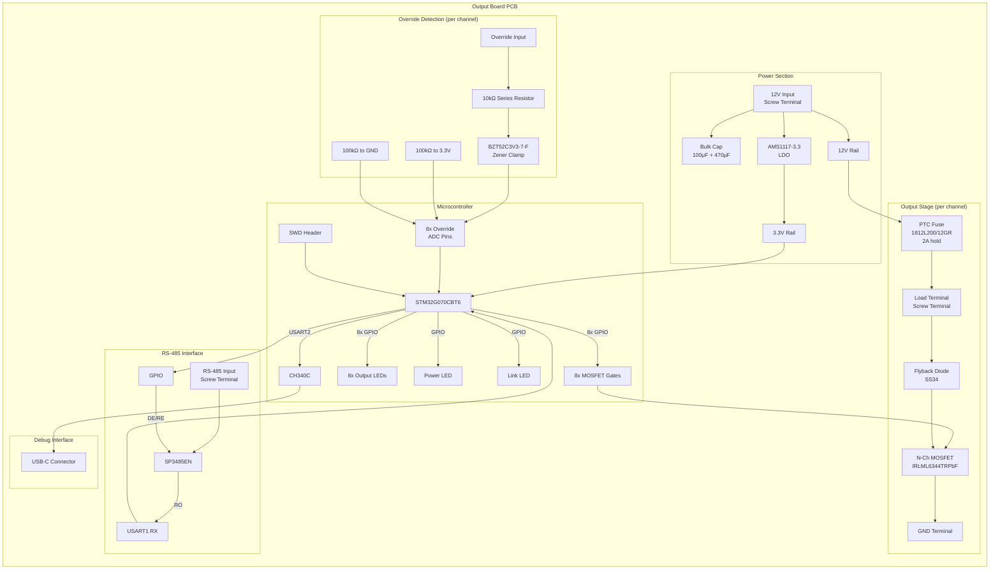

### Output Stage Detail

Each of the 8 output channels uses a low-side N-channel MOSFET switch with per-channel PTC fuse protection:

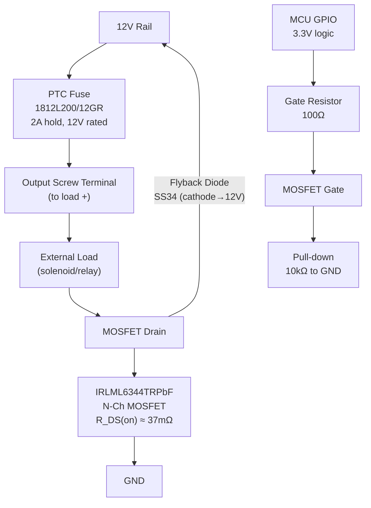

**Component selection rationale**:

- **IRLML6344TRPbF**: Logic-level N-channel MOSFET (Infineon), V_GS(th) ≈ 0.8V, fully enhanced at 3.3V gate drive, R_DS(on) ≈ 37mΩ @ V_GS = 2.5V, V_DS = 30V. SOT-23 package. At 2A: P = I²R = 4 × 0.037 = 0.148W — 2x better thermal margin than SI2302CDS (0.32W) and 50% more voltage headroom.
- **1812L200/12GR**: PTC resettable fuse, 2A hold current, 12V rated, 1812 SMD package. Protects each channel against shorted loads that could damage MOSFETs or PCB traces. The 12V rating is the maximum voltage at which the tripped fuse safely sustains; the LRS-200-12 output voltage trim pot must NOT be adjusted above 12.0V (factory default).
- **SS34**: 3A 40V Schottky barrier diode for flyback protection on inductive loads. SMA package, fast recovery.
- **Gate resistor (100Ω)**: Limits gate charge current, reduces EMI from fast switching edges.
- **Gate pull-down (10kΩ)**: Ensures MOSFET stays off during MCU reset/boot when GPIO pins are high-impedance.

### Override Logic

Each override input uses a **three-state detection** circuit via ADC. The voltage divider used on the input board is **not** used here — instead, a series resistor and Zener clamp protect the ADC pin while the 100k/100k mid-rail bias provides the floating detection:

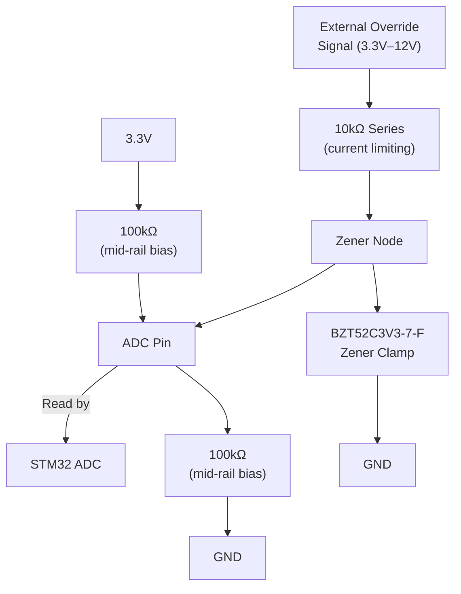

**Corrected ADC reading interpretation**:

| State | ADC Voltage | Meaning |
|-------|-------------|---------|
| Floating (disconnected) | ~1.65V (VCC/2) | No override — serial controls output |
| Driven HIGH (3.3V input) | ~3.03V | Override active — force output ON |
| Driven HIGH (5V input) | ~3.3V (clamped by Zener) | Override active — force output ON |
| Driven HIGH (12V input) | ~3.3V (clamped by Zener) | Override active — force output ON |
| Driven LOW externally | ~0.27V | Override active — force output OFF |

**Why the voltage divider was removed**: The original design ran override inputs through the same 27k/10k divider as the input board, then added 100k/100k mid-rail bias. This caused the circuits to interact — at 3.3V input, the ADC read only ~0.99V (indistinguishable from floating zone), and at 5V it read ~1.39V (still in the dead zone). Only 12V overrides worked. The corrected circuit uses a 10k series resistor for current limiting and a Zener for overvoltage clamping, which lets the external source cleanly overwhelm the high-impedance mid-rail bias.

**Hysteresis bands** in firmware prevent noise-triggered transitions:
- HIGH threshold: enter at >2.4V, exit at <2.1V
- LOW threshold: enter at <0.9V, exit at >1.2V
- Mid-band (1.2V–2.1V) = floating = no override

The 100kΩ pull resistors are high impedance so an external source can easily overwhelm them, but they provide a definitive mid-rail reading when nothing is connected.

### Data Flow (Output Board)

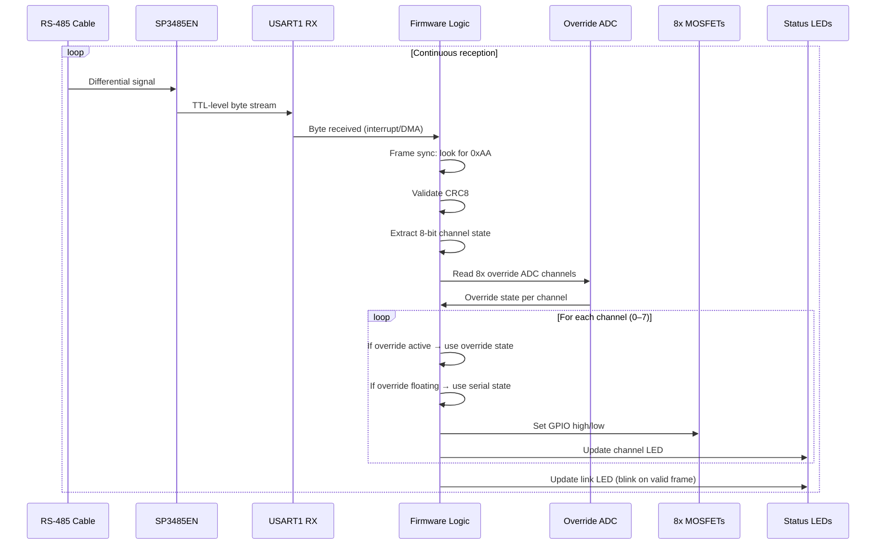

### GPIO Allocation (Output Board)

| Function | Pin Type | Count | Notes |
|----------|----------|-------|-------|
| Override ADC inputs | ADC | 8 | Mid-rail detection channels |
| MOSFET gate drives | GPIO output | 8 | Output channel control |
| Output state LEDs | GPIO output | 8 | Actual output state indicators |
| Power LED | GPIO output | 1 | Always on |
| Link LED | GPIO output | 1 | RX activity blink |
| USART1 TX | Alternate function | 1 | RS-485 data out (heartbeat TX to input board) |
| USART1 RX | Alternate function | 1 | RS-485 data in |
| RS-485 DE/RE | GPIO output | 1 | Transceiver direction (active low = RX) |
| USART2 TX/RX | Alternate function | 2 | CH340C USB-UART bridge |
| SWDIO | Debug | 1 | SWD programming |
| SWCLK | Debug | 1 | SWD programming |
| NRST | System | 1 | Reset |
| **Total** | | **~34** | Well within LQFP48's ~44 usable GPIO — validates LQFP48 choice |

---

## 4. Serial Communication (Hotline v2 Protocol)

### RS-485 Physical Layer

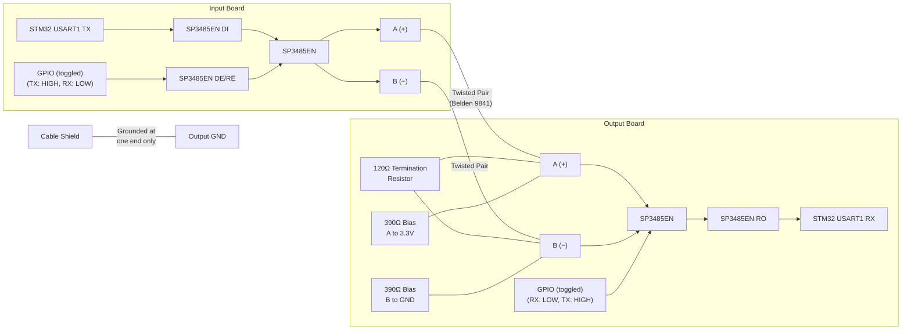

**SP3485EN specifications** (MaxLinear):
- 3.3V supply, half-duplex RS-485 transceiver
- Up to 10 Mbps data rate (115200 baud is ~1% of capacity)
- ±15kV IEC 61000-4-2 ESD protection on bus pins
- Supply current: ~0.5mA typical (2mA max active TX)
- SOIC-8 package, 32-node bus capability

**Cable**: Belden 9841 (1-pair 24AWG shielded twisted pair, 120Ω characteristic impedance, specifically designed for RS-485/EIA-485). The 120Ω termination resistor at the receiver end matches the cable characteristic impedance to prevent reflections. At 200ft / 115200 baud, the cable propagation delay is ~300ns — negligible relative to the latency budget.

**M12 4-pin connector pinout** (at each enclosure):

| Pin | Signal |
|-----|--------|
| 1 | RS-485 A (+) |
| 2 | RS-485 B (−) |
| 3 | Signal GND |
| 4 | Shield/Drain |

### Protocol Specification

The serial protocol (**Hotline v2**) uses a minimal fixed-length frame to minimize overhead and latency:

```
┌──────────┬──────────────┬──────────┐
│ Start    │ Payload      │ CRC8     │
│ 0xAA     │ 8-bit state  │ checksum │
│ (1 byte) │ (1 byte)     │ (1 byte) │
└──────────┴──────────────┴──────────┘
  Byte 0      Byte 1        Byte 2
```

**Byte 0 — Start marker (0xAA)**: Fixed sync byte. The receiver scans the byte stream for 0xAA to align to frame boundaries. The value 0xAA (10101010b) was chosen because its alternating bit pattern is unlikely to appear as a valid CRC of common payloads, reducing false sync.

**Byte 1 — Payload**: Each bit represents one channel (bit 0 = CH0, bit 7 = CH7). `1` = input active/high, `0` = input inactive/low.

**Byte 2 — CRC8**: CRC-8/MAXIM (polynomial 0x31, init 0x00) computed over the payload byte only. The start byte is excluded since it's a fixed constant. This catches single-bit errors and most burst errors in the payload.

**Frame validation on receiver**:
1. Scan for 0xAA byte
2. Read next two bytes (payload + CRC)
3. Compute CRC8 over payload, compare to received CRC
4. If CRC matches → accept frame, update outputs
5. If CRC fails → discard, resync on next 0xAA

**No ACK/retransmit for state frames**: State frames are fire-and-forget. At 1kHz transmission rate, a dropped frame simply means the output holds its previous state for 1ms until the next valid frame arrives. This is far below human perception and acceptable for all target loads. Link health is monitored separately via the 10Hz heartbeat from the output board.

### Timing Analysis

The critical path from input change to output response:


**Detailed latency budget**:

| Stage | Duration | Notes |
|-------|----------|-------|
| Input polling wait | 0–1ms | Worst case: input changes just after a poll |
| ADC conversion (8 channels) | ~10μs | 12-bit SAR ADC, ~1.2μs per channel |
| Frame construction + CRC | ~1μs | Simple bit packing and table-lookup CRC |
| UART transmission (3 bytes) | 260μs | 3 × 10 bits ÷ 115200 baud (8N1 framing) |
| Cable propagation (200ft) | ~300ns | ~5ns/ft for twisted pair |
| UART reception + interrupt | ~15μs | Byte-by-byte interrupt or 3-byte DMA |
| Frame validation + CRC check | ~2μs | CRC8 table lookup |
| Override ADC check | ~10μs | 8-channel scan (can be cached/parallel) |
| Output GPIO write | ~100ns | Direct register write |
| **Total (worst case)** | **~1.30ms** | Well under 10ms target |
| **Total (typical, mid-poll)** | **~0.80ms** | Input change coincides mid-interval |

**Worst-case scenario**: Input changes immediately after a poll cycle completes. The change isn't detected until the next poll 1ms later. After that, the signal path adds ~300μs. Total worst case: **~1.3ms**.

**Absolute worst case with a dropped frame**: If one frame is corrupted, the next valid frame arrives 1ms later. Total: **~2.3ms**. Still well under 10ms.

### Frame Rate and Bandwidth

- Frame size: 3 bytes × 10 bits (8N1) = 30 bits per frame
- Transmission time: 30 / 115200 = **260μs per frame**
- At 1kHz polling: one frame every 1ms, consuming 26% of available bandwidth
- Remaining 74% bandwidth provides margin for future protocol extensions (diagnostics, configuration commands, etc.)

---

## 5. Power Architecture

Both boards share an identical power architecture. The PCB never sees mains voltage — an off-the-shelf AC-DC module inside the enclosure handles isolation.

### Power Distribution

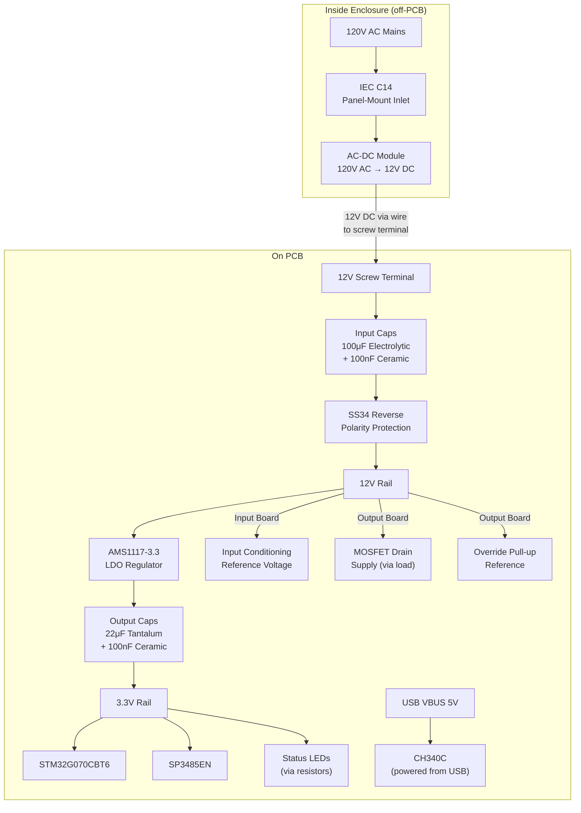

### Power Budget

**Input Board**:

| Consumer | Voltage | Current (typ) | Power |
|----------|---------|---------------|-------|
| STM32G070CBT6 | 3.3V | 15mA | 50mW |
| SP3485EN (TX mode) | 3.3V | 0.5mA | 2mW |
| CH340C | 3.3V | 10mA | 33mW |
| 10x LEDs (@ 5mA each) | 3.3V | 50mA | 165mW |
| Input dividers (8x, ~0.1mA each) | 12V | 0.8mA | 10mW |
| **3.3V rail total** | 3.3V | **~76mA** | 250mW |
| **12V rail total** | 12V | **~1mA** | 10mW |
| **LDO dissipation** | — | — | (12V−3.3V)×76mA = **661mW** |
| **Total from 12V supply** | 12V | **~95mA** | **~921mW** |

The Mean Well IRM-15-12 (15W, 12V, 1.25A, PCB-mount, ~$8) comfortably covers the input board's ~1W total draw.

> **Note**: The CH340C is powered from USB VBUS (5V) when connected, using its internal 3.3V regulator (V3 pin). It does not draw from the board's 3.3V LDO rail. The power budget above is conservative — actual 3.3V draw is lower when USB is disconnected.

**Output Board (all outputs at full load)**:

| Consumer | Voltage | Current (typ) | Power |
|----------|---------|---------------|-------|
| STM32G070CBT6 | 3.3V | 20mA | 66mW |
| SP3485EN (RX mode) | 3.3V | 0.5mA | 2mW |
| CH340C | 3.3V | 10mA | 33mW |
| 10x LEDs (@ 5mA each) | 3.3V | 50mA | 165mW |
| Override bias resistors (8x) | 3.3V | 0.3mA | 1mW |
| **3.3V rail total** | 3.3V | **~81mA** | 267mW |
| 8x outputs @ 2A (through loads) | 12V | 16A max | 192W peak |
| MOSFET losses (8x, 2A, 37mΩ) | — | — | 8 × 0.148W = **1.18W** |
| PTC fuse losses (8x, 2A, ~70mΩ worst case) | — | — | 8 × 0.28W = **~2.24W** |
| **LDO dissipation** | — | — | (12V−3.3V)×81mA = **705mW** |
| **Total from 12V supply (electronics only)** | 12V | **~340mA** | **~4.3W** |
| **Total including loads** | 12V | **~16.35A** | **~197W** |

The output board uses a **Mean Well LRS-200-12** (200W, 17A, enclosed chassis-mount, fanless, ~$28). This single supply powers both the board electronics and all 8 output channels at full 2A load (192W peak). The 200W capacity provides 8W of headroom above the 192W worst-case load scenario.

> **Important**: The LRS-200-12 has a manual 115V/230V input voltage selector switch. It must be set to the 115V position for 120V North American mains. If set to 230V and powered with 120V, the PSU may not start or will output insufficient voltage. If set to 115V and powered with 230V, overcurrent damage may result. The output voltage trim pot must NOT be adjusted above 12.0V (factory default) — the per-channel PTC fuses are rated for 12V maximum. The IRM-15-12 (input board PSU) is auto-ranging (85–264VAC) and requires no switch.

> **Note**: The LDO dissipates ~700mW dropping from 12V to 3.3V. **Mandatory layout requirement**: the AMS1117 SOT-223 thermal pad requires a ground-plane copper pour (reduces θ_JA from ~90°C/W to ~46°C/W). At ~700mW with copper pour, junction rise is ~32°C (safe). Without copper pour, the ~63°C rise at 90°C/W is still safe but leaves less margin at elevated ambient. If the 3.3V load grows significantly, consider a switching regulator.

---

## 6. Firmware Architecture

Both boards run Rust `no_std` firmware using the [Embassy](https://embassy.dev/) async framework, which provides cooperative multitasking, hardware abstraction for STM32, and async UART/ADC drivers — without an RTOS or heap allocation.

### Crate Structure

```
firmware/
├── hotline-protocol/    # Shared protocol crate (no_std, no hardware deps)
│   ├── Cargo.toml
│   └── src/
│       └── lib.rs       # Frame encoding/decoding, CRC8, constants
├── input-controller/    # Input board firmware
│   ├── Cargo.toml
│   ├── build.rs
│   ├── memory.x         # Linker script (STM32G070CB flash/RAM layout)
│   └── src/
│       └── main.rs      # Embassy entry point + async tasks
└── output-controller/   # Output board firmware
    ├── Cargo.toml
    ├── build.rs
    ├── memory.x
    └── src/
        └── main.rs
```

### Input Controller Tasks

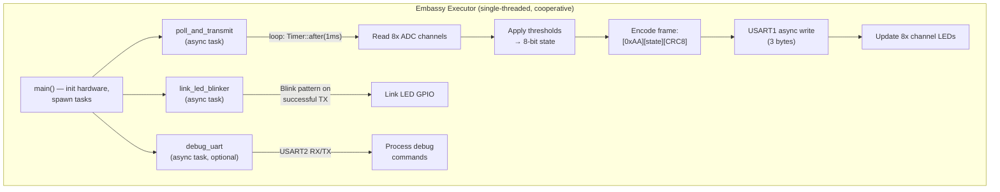

### Output Controller Tasks

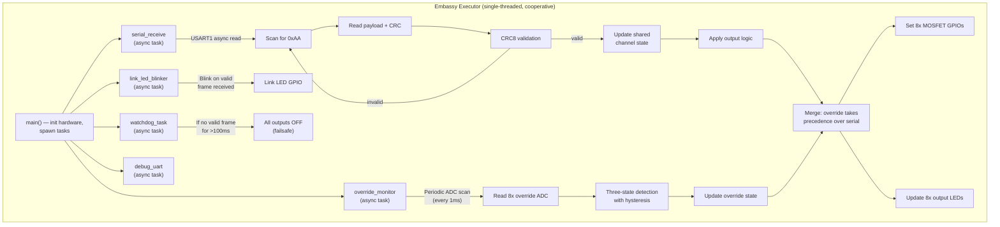

### Shared Protocol Crate (`hotline-protocol`)

The `hotline-protocol` crate is `no_std` and has no hardware dependencies, making it testable on the host and shared between both firmware targets.

**Key types and functions**:

```rust
pub const FRAME_START: u8 = 0xAA;
pub const FRAME_LEN: usize = 3;

pub struct Frame {
    pub payload: u8,  // 8 channel states as bits
}

impl Frame {
    pub fn encode(&self) -> [u8; FRAME_LEN];
    pub fn decode(buf: &[u8; FRAME_LEN]) -> Option<Frame>;
}

pub fn crc8(data: &[u8]) -> u8;  // CRC-8/MAXIM, polynomial 0x31
```

### Failsafe Behavior

The output controller implements a **communication watchdog**: if no valid frame is received within 100ms (100 missed frames at 1kHz), all outputs are driven LOW (off) and the link LED shows a distinct error pattern. This prevents runaway outputs if the cable is disconnected or the input board fails. The 100ms timeout is long enough to ride through occasional burst errors but short enough to respond quickly to a genuine link failure.

---

## 7. Enclosure Integration

The PCB is designed for straightforward integration into a user-designed enclosure. All external connections go through panel-mounted connectors wired to PCB screw terminals — no direct PCB-to-outside-world connections.

### Enclosure Wiring Diagram

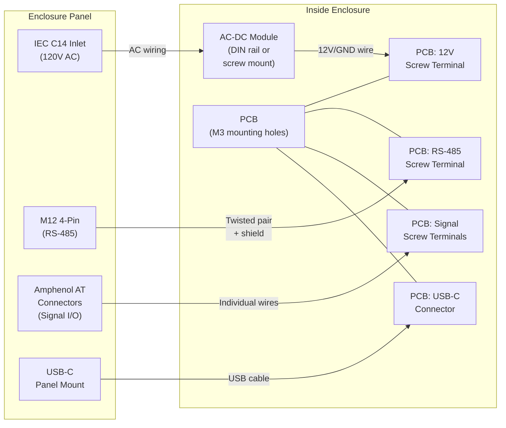

### Screw Terminal Layout

All screw terminals are grouped logically on the PCB edges with clear silkscreen labels:

**Input Board screw terminals**:

| Group | Position | Terminals |
|-------|----------|-----------|
| Power | Top-left | 12V IN, GND |
| Signal Inputs | Left edge | CH0–CH7 (8 terminals), COM/GND |
| RS-485 | Right edge | A (+), B (−), GND, SHIELD |

**Output Board screw terminals**:

| Group | Position | Terminals |
|-------|----------|-----------|
| Power | Top-left | 12V IN, GND |
| RS-485 | Left edge | A (+), B (−), GND, SHIELD |
| Override Inputs | Left edge | OVR0–OVR7 (8 terminals), COM/GND |
| Load Outputs | Right edge | OUT0–OUT7 (8 terminals), 12V LOAD, GND RETURN |

### LED Placement

All 10 LEDs per board are surface-mounted in a single row along one PCB edge (the "LED edge"). The enclosure exposes them through one of:
- A clear polycarbonate window strip
- Individual drilled holes with press-fit light pipes
- Aligned cutouts with silicone gaskets

```
LED Edge (example layout):
┌─────────────────────────────────────────────────┐
│  [PWR] [LINK] [CH0] [CH1] [CH2] [CH3] [CH4] [CH5] [CH6] [CH7]  │
│   🟢    🔵     ◯     ◯     ◯     ◯     ◯     ◯     ◯     ◯     │
└─────────────────────────────────────────────────┘
  Green  Blue   Yellow (channel state indicators)
```

LED colors (suggested):
- **Power**: Green (always on when powered)
- **Link**: Blue (blinks on TX/RX activity, solid = healthy link, off = no link)
- **Channel indicators**: Yellow (on = active input / active output)

### Mounting

- 4x M3 mounting holes in a rectangular pattern
- Holes placed at PCB corners, inset 5mm from edges
- Compatible with standard PCB standoffs (M3 × 6mm hex standoffs recommended)
- Silkscreen marks mounting hole locations and recommended standoff height

---

## 8. Bill of Materials Summary

Key components per board. Detailed BOMs with exact part numbers, supplier links, and pricing are maintained separately in CSV files.

### Common to Both Boards

| Component | Part Number | Package | Qty | Unit Cost (est.) | Notes |
|-----------|-------------|---------|-----|-------------------|-------|
| MCU | STM32G070CBT6 | LQFP48 | 1 | $1.22 | Cortex-M0+, 64MHz, 128KB flash, 36KB SRAM |
| RS-485 Transceiver | SP3485EN-L/TR | SOIC-8 | 1 | $0.21 | 3.3V, half-duplex, ±15kV ESD on bus pins (MaxLinear) |
| RS-485 TVS Diode | SM712 | SOT-23 | 1 | $0.15 | Asymmetric TVS for RS-485 (−7V to +12V clamping) |
| LDO Regulator | AMS1117-3.3 | SOT-223 | 1 | $0.15 | 3.3V, 1A output |
| USB-UART Bridge | CH340C | SOP-16 | 1 | $0.40 | No external crystal; powered from USB VBUS 5V |
| USB-C Connector | — | SMD | 1 | $0.30 | 4-pin power + D+/D− only |
| Bulk Capacitor | 100μF/25V | Electrolytic | 1 | $0.10 | 12V rail filtering |
| Decoupling Caps | 100nF | 0603 ceramic | 10+ | $0.01 | Per-IC decoupling |
| ADC Filter Caps | 10nF | 0603 ceramic | 8 per board | $0.01 | Anti-aliasing on ADC inputs (input conditioning + override) |
| LEDs (green, blue, yellow) | — | 0603 | 10 | $0.03 | Channel + status indicators |
| LED Resistors | 330Ω | 0603 | 10 | $0.01 | ~5mA per LED @ 3.3V |
| SWD Header | 2×5 1.27mm | Through-hole | 1 | $0.20 | Standard ARM 10-pin |
| Screw Terminals | 5.08mm pitch | Through-hole | varies | $0.15/pos | All external connections |
| 120Ω Termination | — | 0603 | 1 | $0.01 | RS-485 line termination (receiver only) |
| ESD Protection | BZT52C3V3-7-F | SOD-123 | varies | $0.04 | ADC input Zener clamp protection |
| Reverse Polarity Protection | SS34 | SMA | 1 | $0.08 | Series Schottky on 12V input, ~0.5V drop |

### Input Board Specific

| Component | Part Number | Package | Qty | Unit Cost (est.) | Notes |
|-----------|-------------|---------|-----|-------------------|-------|
| Divider R_top | 27kΩ | 0603 | 8 | $0.01 | Input voltage scaling |
| Divider R_bot | 10kΩ | 0603 | 8 | $0.01 | Input voltage scaling |

### Output Board Specific

| Component | Part Number | Package | Qty | Unit Cost (est.) | Notes |
|-----------|-------------|---------|-----|-------------------|-------|
| N-Ch MOSFET | IRLML6344TRPbF | SOT-23 | 8 | $0.15 | Logic-level, 37mΩ R_DS(on) @ 2.5V, V_DS=30V |
| PTC Fuse | 1812L200/12GR | 1812 | 8 | $0.05 | 2A hold, 12V rated, per-channel overcurrent protection |
| Flyback Diode | SS34 | SMA | 8 | $0.08 | 3A 40V Schottky |
| Gate Resistor | 100Ω | 0603 | 8 | $0.01 | Slew rate limiting |
| Gate Pull-down | 10kΩ | 0603 | 8 | $0.01 | Default-off during boot |
| Override R_series | 10kΩ | 0603 | 8 | $0.01 | Current limiting for override input |
| Override R_high | 100kΩ | 0603 | 8 | $0.01 | Mid-rail bias (to 3.3V) |
| Override R_low | 100kΩ | 0603 | 8 | $0.01 | Mid-rail bias (to GND) |
| Override Zener | BZT52C3V3-7-F | SOD-123 | 8 | $0.04 | Overvoltage clamp for override inputs |
| RS-485 Bias Resistor | 390Ω | 0603 | 2 | $0.01 | Fail-safe bus biasing (A to 3.3V, B to GND) |

### Off-Board (Per Enclosure)

| Component | Part Number | Package | Qty | Unit Cost (est.) | Notes |
|-----------|-------------|---------|-----|-------------------|-------|
| AC-DC Module (input board) | Mean Well IRM-15-12 | PCB-mount enclosed | 1 | $8.00 | 120V AC → 12V DC, 15W |
| AC-DC Module (output board) | Mean Well LRS-200-12 | Chassis-mount enclosed | 1 | $28.00 | 120V AC → 12V DC, 200W, 17A, fanless |
| IEC C14 Inlet | — | Panel-mount | 1 | $2.00 | With fuse holder |
| M12 4-pin Connector | — | Panel-mount | 1 | $3.00 | RS-485 cable interface |
| Amphenol AT Connectors | — | Panel-mount | varies | $2–5 each | Signal I/O, IP67 |

### Estimated Per-Board Cost

| | Input Board | Output Board |
|-|-------------|-------------|
| PCB fabrication (JLCPCB, qty 10) | ~$2 | ~$2 |
| Components (on-board) | ~$6 | ~$14 |
| Off-board enclosure parts | ~$18 | ~$38 |
| **Total per unit** | **~$26** | **~$54** |

Both boards are under the $100 limit. The input board is well under the $50 target. The output board exceeds $50 due to the LRS-200-12 PSU (~$28), which is required to power 8x 2A load channels.

---

## 9. Design Constraints and Trade-offs

### Constraints

| Constraint | Impact | Mitigation |
|------------|--------|------------|
| <10ms end-to-end latency | Drives 1kHz polling rate, simple protocol, no handshaking | Timing analysis shows ~1.3ms worst case — 7.7ms margin |
| Up to 200ft cable run | Requires differential signaling (RS-485), not plain UART | SP3485EN + 120Ω termination + shielded cable |
| 3.3V–12V input range | Can't use simple digital GPIO reads; needs ADC + divider | Resistor divider scales to 0–3.3V; firmware threshold detection |
| IP67 external connectors | Panel-mount connectors add cost and assembly steps | Amphenol AT (automotive-grade, widely available, cost-effective) |
| PCB never sees mains voltage | Requires off-board AC-DC module and wire routing | Off-the-shelf Mean Well module, clear assembly documentation |
| LQFP48 GPIO budget (output board ~34 pins used) | Tight pin allocation, limited room for expansion | Validated pin count; LQFP48 with G071 provides ~44 GPIO |

### Trade-offs

**Half-duplex bidirectional serial link**

- **Chosen**: Half-duplex bidirectional. Primary: input→output state frames at 1kHz. Reverse: output→input heartbeat frames at 10Hz. The input board is bus master and controls turnaround timing.
- **Trade-off**: Slightly more complex firmware (DE/RE toggling, bus turnaround timing) vs. simpler unidirectional approach. Adds ~500μs bus turnaround window per 1ms cycle.
- **Benefit**: Input board knows if the output board is alive and healthy. Link LED shows true end-to-end link status rather than just TX activity. Heartbeat carries output board status flags for diagnostics. Both boards have independent USB debug ports for additional diagnostics.

**AMS1117 LDO vs. switching regulator**

- **Chosen**: AMS1117-3.3 LDO. Simple, cheap ($0.15), no external inductor, low noise on 3.3V rail.
- **Trade-off**: Wastes ~700mW as heat dropping 12V to 3.3V at 80mA. Efficiency is only ~28%.
- **Mitigation**: 700mW is well within the SOT-223 package's thermal capacity with adequate copper pour. Total system power is low enough that efficiency doesn't matter. The 12V supply has ample headroom.

**ADC threshold detection vs. analog comparators**

- **Chosen**: ADC reads + software threshold. Reuses the STM32's built-in ADC for both input channels and override detection. Single peripheral handles all analog sensing.
- **Trade-off**: Slightly slower than hardware comparators (microseconds vs. nanoseconds). Software hysteresis requires careful tuning.
- **Mitigation**: The ADC scan time (~10μs for 8 channels) is negligible relative to the 1ms polling interval. Software hysteresis is more flexible than hardware — thresholds can be tuned without board changes.

**No galvanic isolation on inputs/outputs**

- **Chosen**: Direct resistor-divider connection from external inputs to MCU ADC. Direct MOSFET drive on outputs.
- **Trade-off**: Ground loops possible if input devices and output devices are on different ground references. No protection against large common-mode voltages.
- **Mitigation**: The system is designed for a single-site installation where all devices share a common ground. The RS-485 link provides natural common-mode rejection between the two enclosures. If isolation is needed in the future, optocouplers can be added per channel.

**1kHz polling vs. interrupt-driven input change detection**

- **Chosen**: Fixed 1kHz polling rate. Simple, predictable timing, constant bandwidth usage.
- **Trade-off**: Uses bandwidth even when no inputs change. Maximum 1ms detection latency.
- **Mitigation**: At 115200 baud, the 3-byte frame uses only 26% of bandwidth. 1ms worst-case detection latency gives 8.7ms margin before the 10ms target. Interrupt-driven would save power and bandwidth but adds complexity with no meaningful latency improvement for this application.

**IRLML6344TRPbF (SOT-23) vs. larger MOSFET packages**

- **Chosen**: IRLML6344TRPbF in SOT-23 — small footprint, logic-level, excellent R_DS(on) (37mΩ @ V_GS=2.5V).
- **Trade-off**: Limited to ~2.5A continuous and ~0.5W dissipation in SOT-23 without extra copper. Not suitable for significantly higher current loads.
- **Mitigation**: 2A per channel meets the design spec. The 37mΩ R_DS(on) at 2A dissipates only 148mW, well within SOT-23 limits with significant thermal margin. For higher current applications, the footprint could be upgraded to a DPAK MOSFET with minimal PCB changes.
