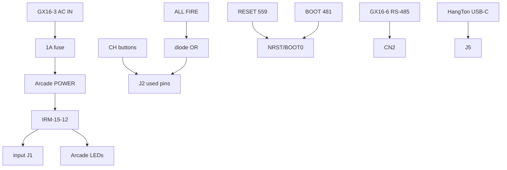
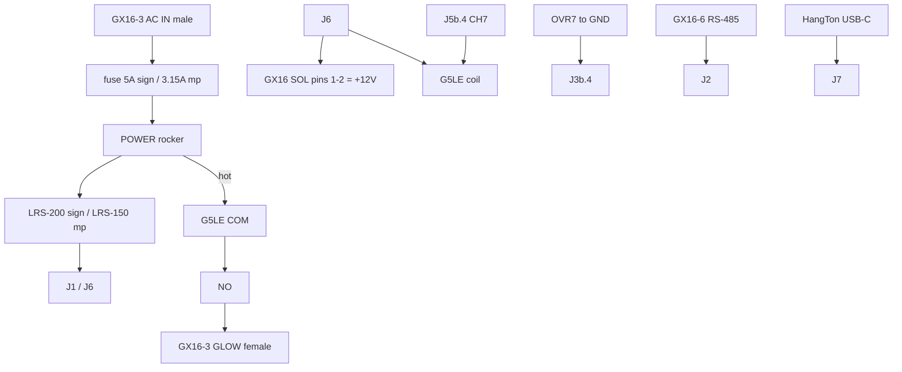

# Enclosure wiring (budget GX16 platform)

Applies to all four boxes. Connector family: **GX16** (not Buccaneer / Phoenix M12 / AT). Parts: [`PARTS_BOM.md`](PARTS_BOM.md).

---

## Part A — Input (sign-input / mp-input)

### ALL FIRE rule

| Box | Front buttons | MCU bits | Diodes |
| --- | --- | --- | --- |
| sign-input | CH1..CH5 | CH0..CH4 | D1..D5 only |
| mp-input | CH1..CH3 | CH0..CH2 | D1..D3 only |

Do not wire unused diode pads or unused `J2` pins.

### Input block diagram

### POWER (input)

Arcade latch: fuse load → switch → IRM `AC/L`. Neutral unswitched. PE to inlet PE only (IRM is Class II).

### RESET / BOOT

COM → GND; NO → `NRST` / `BOOT0`.

---

## Part B — Output (sign-output / mp-output)

### Output block diagram

### AC segregation

| Path | Gauge | Notes |
| --- | --- | --- |
| AC L/N/PE in | 16–18 AWG | GX16-3 panel **male**; fuse **5 A** (sign) / **3.15 A** (mp) / **1 A** (input) TD |
| Fuse → POWER → LRS AC/L + relay COM | 16–18 AWG | Hot only switched |
| Glow hot (relay NO) + N | 16–18 AWG | GX16-3 panel **female** |
| 12 V to J1/J6 | 16–18 AWG | — |
| Solenoid multipin | 18 AWG | — |
| Coil / OVR | 22 AWG | — |
| RS-485 | 24 AWG | — |

Keep AC loom separate from 12 V / RS-485 (≥6 mm / separate bundle).

### Solenoid multipin

**sign GX16-8:** pins **1–2** = `+12V` paralleled; 3–7 = OUT0..4; 8 = NC.  
**mp GX16-6:** pins **1–2** = `+12V` paralleled; 3–5 = OUT0..2; 6 = NC.

Do **not** put all solenoid current through a single 5 A pin.

### Glow / CH7 always-on

1. Strap `J3b.4` → `J4` GND.  
2. Coil: `J6` → G5LE → `J5b.4`.  
3. COM ← AC hot after POWER; NO → glow hot; N → glow N.

### RS-485 GX16-6

| Pin | Signal |
| ---: | --- |
| 1–2 | TX+ / TX− |
| 3–4 | RX+ / RX− |
| 5 | GND |
| 6 | SHIELD |

Field cable **crossovers** TX↔RX between input and output boxes ([`../PIN_MAP.md`](../PIN_MAP.md)).

### USB-C

HangTon panel F–F bulkhead → short USB-C **M–M** jumper → board `J5` (input) / `J7` (output). Weather **cap on** when unused (**IP65**). Keep USB loom away from AC.

---

## Ground stars

**Input 12 V:** IRM −V → J1.GND, J3, LED−, RS-485 pin5, RESET/BOOT COM.  
**Output 12 V:** LRS −V → J1.GND, J4, RS-485 pin5, RESET/BOOT COM. Load returns only via `J5` FETs.

---

## Assembly order (output)

1. Print + gasket; mount LRS; set **115 V**.  
2. Fit all GX16 panels (AC male, glow female, RS-485, solenoids), HangTon USB, POWER, RESET, BOOT.  
3. Wire AC cold; PE bonded; fuse in.  
4. Bring up 12.0 V before loads.  
5. Fit OVR7 strap + G5LE.  
6. Verify glow with POWER; solenoids follow serial.
