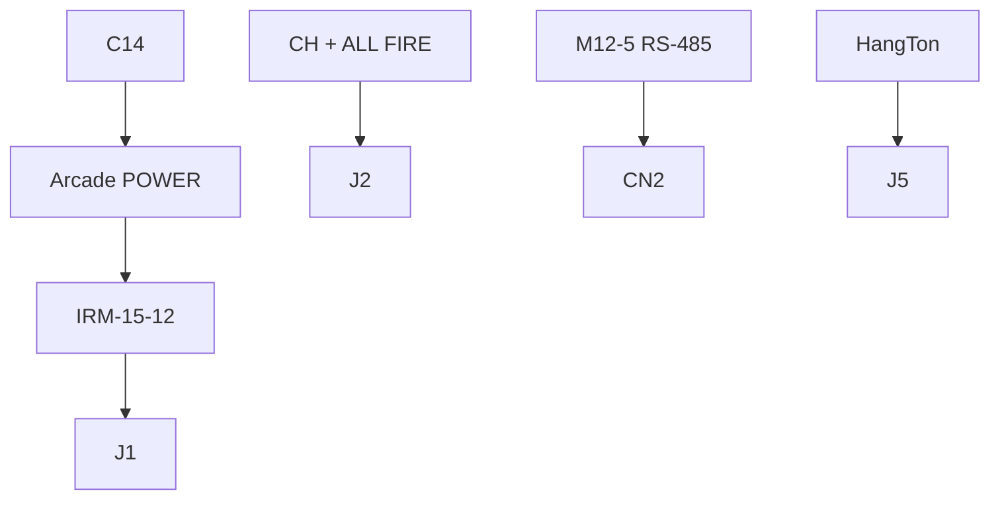
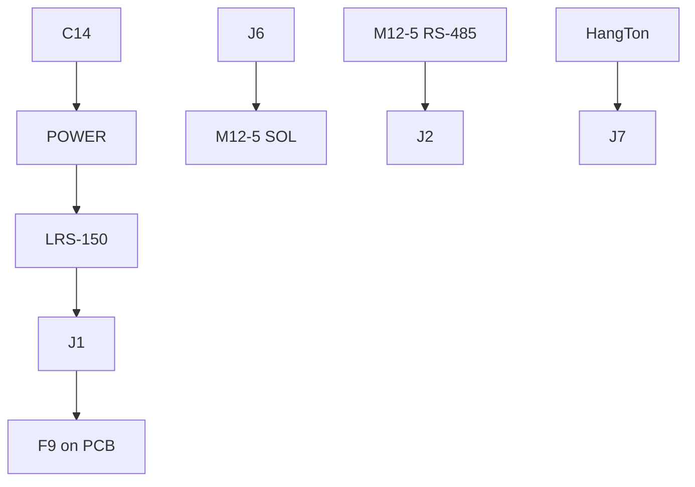

# Enclosure wiring

Parts: [`SHOPPING_LIST.md`](SHOPPING_LIST.md).

M12 field I/O: A-coded screw-terminal, panel **female**. AC: C14 male inlet + C13 cord. USB: HangTon bulkhead.

---

## Gender

| Port | Panel | Mate |
| --- | --- | --- |
| AC IN C14 | Male | C13 cord |
| RS-485 / SOL M12 | Female | Male field half |
| USB-C HangTon | Female | Host cable |

---

## Protection

```text
Wall → C13 → C14 → POWER → PSU AC
                    PSU 12V → J1 → (outputs: F9 → channels + PTCs)
```

| Layer | Part |
| --- | --- |
| AC primary | IRM / LRS internal fuse |
| 12 V board feed | Output PCB `F9` 25 A ATO |
| Each solenoid | Output PCB PTC `F1`..`F8` |

---

## Input (sign-input / mp-input)



---

## Outputs

### sign-output


### mp-output



---

## Gauges

| Path | Gauge |
| --- | --- |
| AC L/N/PE | 18 AWG 300 V |
| Solenoid 12 V | 18 AWG |
| RS-485 | 24 AWG / Belden 9842 |
| NRST, BOOT, USB | 24–28 AWG |

---

## Pin maps

**RS-485 M12-5:** 1 TX+, 2 TX−, 3 RX+, 4 RX−, 5 GND; shell = SHIELD. Field cable TX↔RX crossover.

**SOL sign M12-8:** 1–2 = +12V paralleled; 3–7 = OUT0..4; 8 = NC.

**SOL mp M12-5:** 1–2 = +12V paralleled; 3–5 = OUT0..2.

---

## Assembly

1. Open M12 housing → screw wires to terminals → strain relief.  
2. Panel nut from inside.  
3. Keep AC loom away from RS-485.  
4. Parallel two M12 pins for solenoid `+12V`.  
5. Seat output `F9` before connecting loads.
