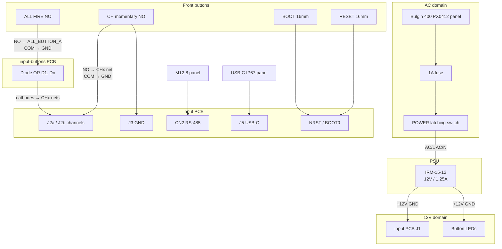

# Enclosure wiring

Applies to **sign-input** and **mp-input**. Only the number of channel buttons differs.

## Block diagram



## Channel map

### sign-input

| Front label | Input net | Board terminal | Diode |
| --- | --- | --- | --- |
| CH1 / Sign A | `IN_CH0` | `J2a.1` | D1 |
| CH2 / Sign B | `IN_CH1` | `J2a.2` | D2 |
| CH3 / Sign C | `IN_CH2` | `J2a.3` | D3 |
| CH4 / Sign D | `IN_CH3` | `J2a.4` | D4 |
| CH5 / Sign E | `IN_CH4` | `J2b.1` | D5 |
| ALL FIRE | `ALL_BUTTON_A` | via diodes → CH0..CH4 | D1..D5 |
| — | unused | `J2b.2..4` | leave open |

### mp-input

| Front label | Input net | Board terminal | Diode |
| --- | --- | --- | --- |
| CH1 | `IN_CH0` | `J2a.1` | D1 |
| CH2 | `IN_CH1` | `J2a.2` | D2 |
| CH3 | `IN_CH2` | `J2a.3` | D3 |
| ALL FIRE | `ALL_BUTTON_A` | via diodes → CH0..CH2 | D1..D3 |
| — | unused | rest of J2 | leave open |

Polarity reminder: closed button → channel line to **GND** → Schmitt **HIGH** on MCU = active.

## Per-button wiring (arcade momentary channel / ALL)

Pin names vary by arcade switch — map to:

| Switch pin | Wire to |
| --- | --- |
| NO | Channel net **or** `ALL_BUTTON_A` |
| COM / C | `GND` (board `J3` and PSU −V star) |
| LED+ (if lit) | `+12V` |
| LED− (if lit) | `GND` |

ALL FIRE does **not** connect directly to a channel terminal; it only grounds `ALL_BUTTON_A` on the daughter PCB so diodes pull the used channel nets low.

## POWER switch (latching, AC)

| Contact | Connection |
| --- | --- |
| Common / pole | Fuse load side (from IEC Line) |
| NO (latched ON) | IRM `AC/L` |
| Neutral | IEC Neutral → IRM `AC/N` (unswitched) |
| LED+ / LED− | `+12V` / `GND` (lights only when PSU is up) |

Class II IRM has **no PE pin**. If using a metal panel, bond PE from inlet to chassis only if the inlet provides PE; plastic print → leave PE open / cap.

## RESET / BOOT

| Button | MCU / board |
| --- | --- |
| RESET COM | GND |
| RESET NO | `NRST` (SW1 net / SWD `J6` NRST) |
| BOOT COM | GND |
| BOOT NO | `BOOT0` (SW2 net) |

DFU entry (same as bring-up): hold BOOT → tap RESET → release BOOT. Panel buttons replace onboard SW1/SW2; leave onboard switches accessible or desolder if they fight the panel (parallel NO to GND is OK if both open by default).

## RS-485 M12 pinout (recommended)

Use the same logical map as board `CN2`, then field cable **crossover** to the output box per [`../PIN_MAP.md`](../PIN_MAP.md).

| M12 pin | Signal | Board `CN2` |
| ---: | --- | --- |
| 1 | TX+ | 1 |
| 2 | TX− | 2 |
| 3 | RX+ | 3 |
| 4 | RX− | 4 |
| 5 | GND | 5 |
| 6 | SHIELD | 6 |
| 7 | NC | — |
| 8 | NC | — |

Pair TX± and RX±. Shield drain → pin 6 only (already bonded to GND on PCB).

## USB-C

Panel IP67 USB-C → short pigtail → board `J5`. Mount so the sealed face is outside; keep the board USB-C unused or covered.

## Grounding / star point

```text
PSU −V ──┬── input J1.GND
         ├── J3 (switch returns)
         ├── all LED−
         ├── M12 pin 5
         └── RESET/BOOT COM
```

Do **not** return LED or switch currents through RS-485 cable shield as the only GND.

## Assembly order

1. Print + install heat-sets, gasket, panel connectors (dry fit).
2. Mount IRM on insulated carrier; wire AC with POWER **off**.
3. Bring up 12 V alone; measure before plugging input PCB.
4. Wire LEDs; confirm current &lt; 0.4 A total.
5. Wire channel / ALL / diode PCB; verify with firmware LEDs.
6. Fit USB + M12 last; seal nuts with thin RTV if needed.
